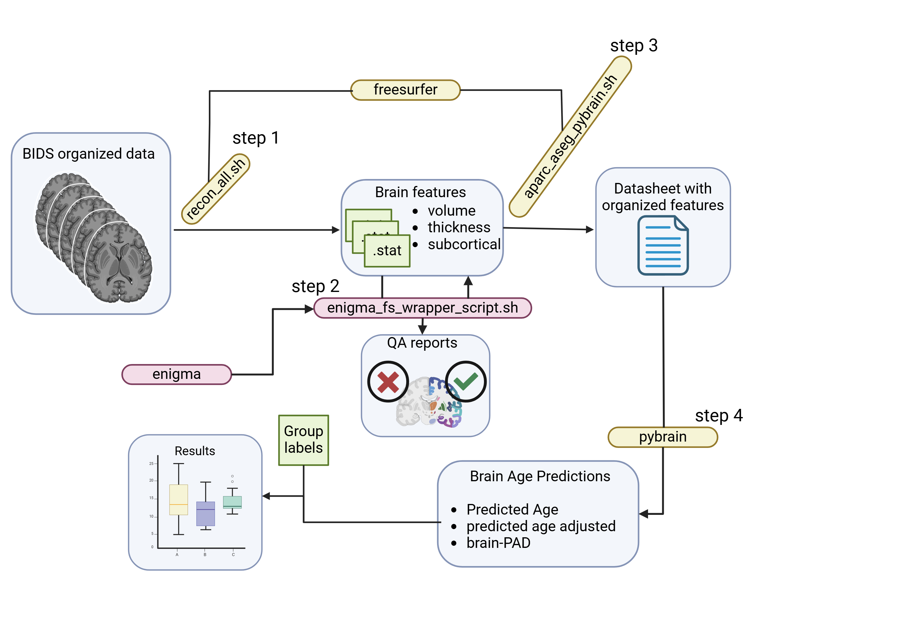

# SCI MAP
## Project Description

SCI_MAP is designed to analyze structural brain differences between individuals with spinal cord injury and healthy age-matched controls. The project has two main objectives:

1. Compare structural brain characteristics between SCI patients and healthy controls
2. Investigate structural brain changes in SCI patients who develop neuropathic pain


## Prerequisites

To participate in this project, you need:

1. **Neuroimaging Data**
   - 3D T1-weighted MRI scans
   - Data must be organized in BIDS format
   - Both SCI and control cohort scans

2. **Software Requirements**
   - FreeSurfer (installed and operational)
   - Python dependencies (listed in requirements.txt)

3. **Metadata Requirements**
   - Subject ID
   - Age
   - Cohort designation (SCI or Control)
   - Neuropathic pain status for SCI participants

## Data Structure

Your data should be organized following BIDS conventions: 

## Repository Purpose and Processing Pipeline

This repository serves as a centralized location for sharing processing scripts with all participating institutes in the SCI_MAP project. The standardized scripts ensure consistent analysis across different sites and datasets.



### Step 1: FreeSurfer Processing (reconall.sh)

The initial processing step uses the `reconall.sh` script located in the processing folder. This script can be run on:
- Linux systems
- Windows systems using Windows Subsystem for Linux (WSL)
  - Recommended: Ubuntu on WSL
  - Make sure FreeSurfer is properly installed in your WSL environment

The script:

1. Takes BIDS-formatted T1w images as input
2. Applies FreeSurfer's `recon-all` command to perform:
   - Skull stripping
   - White matter segmentation
   - Surface reconstruction
   - Cortical parcellation
   - Subcortical segmentation
3. Generates structural information for subsequent analysis

**System Requirements:**
- For Windows users: WSL installed with Ubuntu distribution
- FreeSurfer properly configured in your Linux/WSL environment
- Sufficient disk space for FreeSurfer outputs (~1GB per subject)

#### Usage
1. Open the `reconall.sh` script and update the directory paths:
   ```bash
   # Update these paths in reconall.sh
   RAWDATA_DIR="/path/to/your/bids/dataset"      # Directory containing your BIDS-formatted T1w images
   DERIVATIVES_DIR="/path/to/output/derivatives"  # Directory where FreeSurfer outputs will be saved
   ```

2. Make the script executable and run it:
   ```bash
   chmod +x processing/reconall.sh
   ./processing/reconall.sh
   ```

**Error Handling Tip:**
If you encounter script execution errors, especially when running on WSL or after editing on Windows, you may need to fix line endings using dos2unix:
```bash
# Install dos2unix if not already installed
sudo apt-get install dos2unix

# Convert the script to Unix format
dos2unix processing/reconall.sh
```
This fixes the "bad interpreter" or similar errors caused by Windows-style line endings (CRLF).

The script will:
- Process all subjects found in your BIDS directory
- Create a FreeSurfer output directory for each subject
- Generate logs in the derivatives directory

**Example Directory Structure:**
```
study/
├── rawdata/                  # Your RAWDATA_DIR
│   ├── sub-001/
│   │   └── anat/
│   │       └── sub-001_T1w.nii.gz
│   └── sub-002/
│       └── anat/
│           └── sub-002_T1w.nii.gz
└── derivatives/              # Your DERIVATIVES_DIR
    └── freesurfer/
        ├── sub-001/
        └── sub-002/
```

#### Processing Time
- Approximately 20 minutes per subject (benchmarked on NVIDIA 4070Ti)

### Step 2: Quality Assurance (Work in Progress)

Quality control of the FreeSurfer outputs is performed using the ENIGMA QA pipeline. This step ensures the quality and reliability of the structural processing before proceeding with further analysis.

#### QA Pipeline Features (Coming Soon)
- Automated quality metrics assessment
- Visual QC report generation
- Identification of potential processing failures
- Standardized QC criteria based on ENIGMA protocols

[Detailed documentation will be added once the QA pipeline is implemented]

### Step 3: Data Organization for Brain Age Prediction (aparc_aseg_pybrain.sh)

After FreeSurfer processing and quality assurance, the next step involves organizing the structural data into a format compatible with PyBrain for brain age prediction analysis. This is done using the `aparc_aseg_pybrain.sh` script, which:

1. Extracts relevant metrics from FreeSurfer's aparc and aseg outputs
2. Organizes the data into a standardized format required by PyBrain
3. Generates a consolidated dataset for brain age prediction

#### Usage
1. Open the `aparc_aseg_pybrain.sh` script and update the directory paths:
   ```bash
   # Update these paths in aparc_aseg_pybrain.sh
   ROOT_DIR="/path/to/your/freesurfer/subjects"    # Directory containing FreeSurfer processed subjects
   OUTPUT_DIR="/path/to/save/pybrain/features"     # Directory where the output CSV will be saved
   ```

2. Make the script executable and run it:
   ```bash
   chmod +x processing/aparc_aseg_pybrain.sh
   ./processing/aparc_aseg_pybrain.sh
   ```

**Note:** Like the reconall.sh script, this can be run on:
- Linux systems
- Windows systems using WSL (Ubuntu recommended)

**Error Handling Tip:**
If you encounter script execution errors, fix line endings using dos2unix:
```bash
dos2unix processing/aparc_aseg_pybrain.sh
```

The script will generate a CSV file containing all the required features for brain age prediction.

### Step 4: Age Data Integration

The final preparation step involves manually adding participant age information to your dataset:

1. Open the output file from Step 3
2. Add a new column for age as the second column (right after subject ID)
3. Save the file as 'subject_features.csv' with the following structure:

subject_id,age,feature1,feature2,...

### Step 5: Brain Age Prediction

Use the `predict.py` script to generate brain age predictions for your cohort using the PyBrain model:

#### Required Path Configuration
Before running the prediction script, you need to modify the following paths in `predict.py`:

1. `age_data_path`: Path to your subject_features.csv file
   ```python
   age_data_path = "/path/to/your/subject_features.csv"
   ```

2. `model_path`: Path to the ExtraTreesModel file
   ```python
   model_path = "/path/to/PyBrainAge-main/software/ExtraTreesModel"
   ```

3. `scaler_path`: Path to the scaler.pkl file
   ```python
   scaler_path = "/path/to/PyBrainAge-main/software/scaler.pkl"
   ```

**Important Note:** Due to file size limitations, the ExtraTreesModel and scaler files are not directly stored in this repository. To obtain these files:

1. Download them from the original PyBrain repository:
   - Visit https://github.com/james-cole/PyBrainAge
   - Navigate to the software directory
   - Download ExtraTreesModel and scaler.pkl files

2. Place the files in your local SCI_MAP directory:
   ```
   SCI_MAP/
   └── PyBrainAge-main/
       └── software/
           ├── ExtraTreesModel
           └── scaler.pkl
   ```

3. Update the paths in your predict.py script accordingly

**Python Environment Setup:**
The ExtraTreesModel and scaler.pkl files were built using specific Python dependencies. To ensure compatibility:

1. Create a new conda environment following PyBrain's requirements:
   ```bash
   conda create  --name pybrainage_env python=3.7 scikit-learn=0.24.2 pandas=1.3.4 numpy=1.20.3
   conda activate pybrainage_env 
   ```


2. Install the required dependencies as specified in the PyBrain repository:
   - Follow the installation steps at https://github.com/james-cole/PyBrainAge
   - This ensures correct versions of scikit-learn, pandas, and other dependencies

**Note:** Using different Python versions or package versions may cause compatibility issues when loading the model and scaler files.

If you have trouble accessing these files, please contact:
- The original PyBrain repository maintainers
- The SCI_MAP project coordinators

#### Usage


