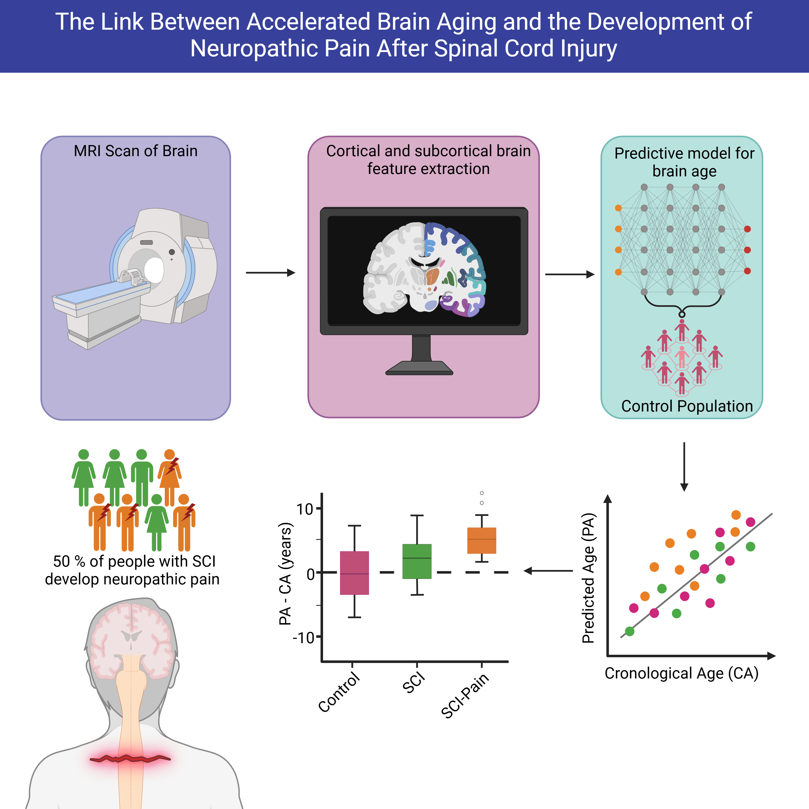
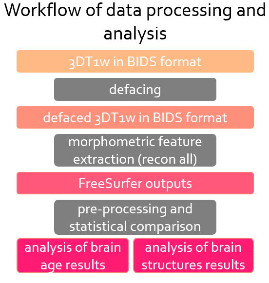
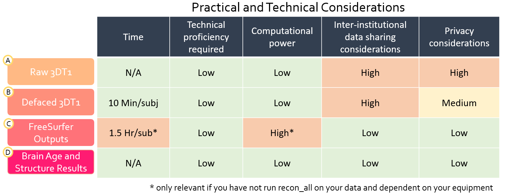
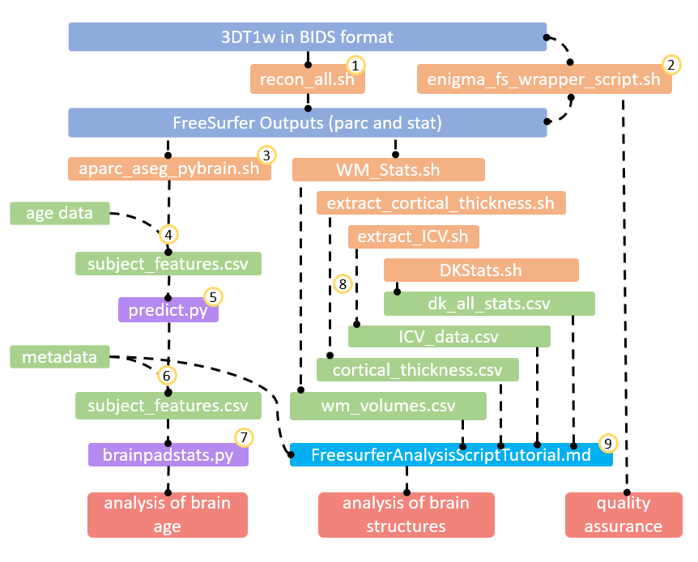
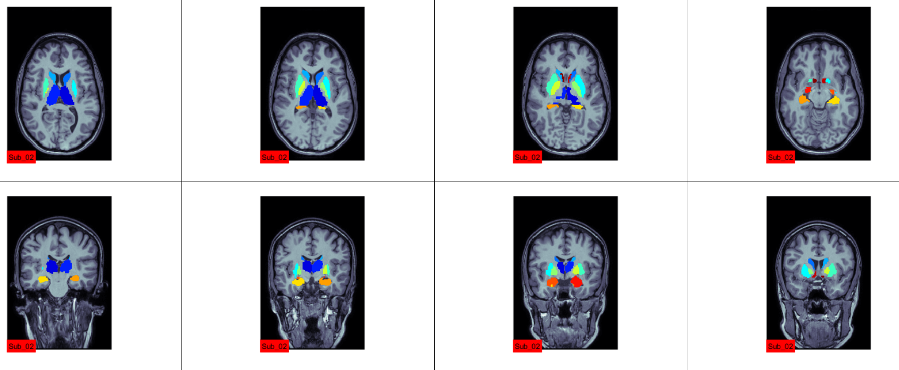
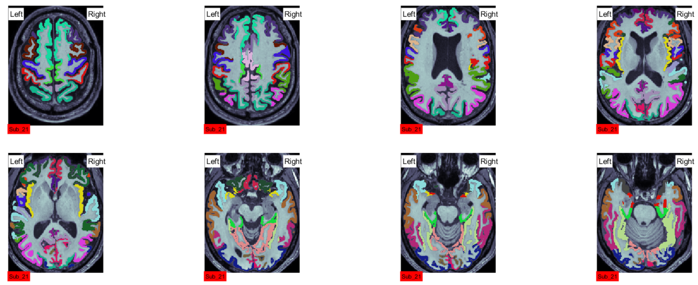
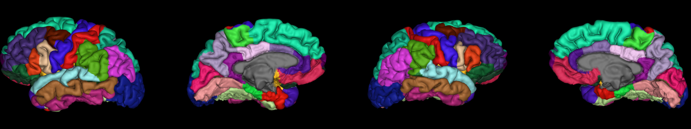

# SCI MAP
## Project Description

The SCI_MAP project is designed to analyze structural brain differences between individuals with spinal cord injury (SCI) and healthy age-matched controls. In SCI, alterations in brain structure and function can arise due to direct effects of nerve damage, secondary mechanisms, and long-term consequences such as paralysis and neuropathic pain. Structural brain maturation in humans is known to follow region-specific, non-linear trajectories characterized by progressive or regressive changes, such as gray matter atrophy.

One of the primary goals of this project is to utilize the Brain Age Gap Estimation (BrainAGE) biomarker to quantify age-related deviations in brain structure. BrainAGE is calculated as the difference between an individual’s predicted brain age—estimated using T1-weighted structural MRI—and their chronological age. In this project, apparent brain age is determined using a normative model trained on 29,175 scans, primarily from the UK Biobank, spanning a wide age range from 2 to 100 years.

In addition to BrainAGE-based analysis, a second primary aim of the project is to investigate regional, surface-based morphometric changes in the brain. such as cortical thickness, surface area and curvature. This approach will assess localized structural alterations in specific cortical and subcortical regions, aiming to identify and quantify subtle changes that may be associated with SCI and neuropathic pain—changes that might be obscured by aggregate biomarkers like BrainAGE. By focusing on surface area, cortical thickness, and volume metrics derived from individual brain regions, we hope to capture fine-grained structural signatures of adaptive or maladaptive plasticity.

This project also addresses the longstanding issue of limited sample sizes in SCI research, while taking into account privacy and ethical constraints surrounding the sharing of individual brain images across institutions. To that end, this repository provides each participating center with a standardized, baseline processing pipeline that enables local data analysis and avoids the need to transfer sensitive imaging data. This harmonized approach ensures that results remain comparable across sites and that meta-analyses can be reliably conducted. 

NOTE: The current pipeline has been tested in a Windows 10 system using Ubuntu WSL. 



Figure 1. Visual Summary of the project. 


After local processing, institutions are encouraged to share their FreeSurfer outputs (following Step 1 of the pipeline) along with non-identifiable subject metadata. These outputs can then be centrally aggregated by the coordinating team in Vancouver for further analysis and meta-analytic synthesis. As FreeSurfer outputs do not contain directly identifiable information, this method offers a secure and efficient mechanism for collaborative data pooling.



Figure 2. Steps to the pipeline


However, recognizing that data sharing policies and logistical constraints vary across institutions, the pipeline has been designed to offer multiple integration points. Institutions can contribute at various stages based on their technical capabilities and ethical guidelines, ensuring broad participation without compromising compliance. Below there is a chart with the information to consider when deciding what step of the pipeline would be ideal your institution to share your data



Figure 3. Considerations when deciding on the step your institution would like to share your data. 

## Prerequisites

To participate in this project, you need:

1. **Neuroimaging Data**
   - 3D T1-weighted MRI scans from both SCI and (age and sex matched) control cohort scans
   - Data must be organized in BIDS format
   - Alternatively, you can also have the recon-all outputs from FreeSurfer

2. **Software Requirements**
   - WSL installation (Here tested on Ubuntu 22.04.5 LTS )
   - FreeSurfer (installed and operational, here tested on 7.4.1)
   - Python dependencies (listed in requirements.txt)
   - Matlab executable from WSL
   - RStudio

3. **Metadata Requirements**
   - Subject ID
   - Age
   - Cohort designation (SCI or Control)
   - Neuropathic pain status for SCI participants (if pain analysis is to be done)

## Data Structure

Your data should be organized following BIDS conventions. Ensure your naming schemes are consistent subject folders and image names (e.g. all subject folders are labeled as sub-xx where xx is the subject number, and all anatomical images follow a similar structure of sub-xx_T1w.nii.gz). Refer to datastructure below or refer to https://bids.neuroimaging.io/index.html

## Repository Purpose and Processing Pipeline

This repository serves as a centralized location for sharing processing scripts with all participating institutes in the SCI_MAP project. The standardized scripts ensure consistent analysis across different sites and datasets.



Figure 2. Summary of standarized steps for proecessing the data. Blue boxes represent FreeSurfer related outputs. Orange boxes represent bash scripts that need to be run in a WSL or linux environment. Purple boxes represent python scripts. Blue represents R scripts. Green represent .csv files. Finally, red represents the outputs that would be required to be sent for the meta analysis. 

### Step 0 (Optional): Defacing

**Defacing** refers to the removal of facial features from MRI scans to protect patient identity. Defacing raw 3D T1-weighted images ensures that medical imaging data can be shared ethically across institutions while respecting and preserving the anonymity of each participant. This step is only necessary if you plan to share raw 3D T1 images with the Vancouver team for pipeline processing. Therefore, we will not go into detail on how to perform defacing here. However, tools such as [**pydeface**](https://github.com/poldracklab/pydeface), [**mri_deface**](https://surfer.nmr.mgh.harvard.edu/fswiki/mri_deface), and [**fsl_deface**](https://fsl.fmrib.ox.ac.uk/fsl/fslwiki/fsl_deface) can be used to properly and ethically deface your images before sharing.


### Step 1: FreeSurfer Processing (recon_all.sh)

**Note:** If you have already run FreeSurfer's recon-all on your data, you can skip this step and proceed directly to Step 2. However, ensure you have a working FreeSurfer installation as it will be required for Step 3.

The initial processing step uses the `recon_all.sh` script located in the Step_1_Preprocessing folder. This script can be run on:
- Linux systems
- Windows systems using Windows Subsystem for Linux (WSL)
  - Recommended: Ubuntu on WSL
  - Make sure FreeSurfer is properly installed in your WSL environment

The script:

1. Takes BIDS-formatted T1w images as input
2. Applies FreeSurfer's `recon-all` command to perform:
   - Skull stripping
   - White matter segmentation
   - Surface reconstruction
   - Cortical parcellation
   - Subcortical segmentation
3. Generates structural information for subsequent analysis

**System Requirements:**
- For Windows users: WSL installed with Ubuntu distribution
- FreeSurfer properly configured in your Linux/WSL environment
- Sufficient disk space for FreeSurfer outputs (~1GB per subject)
- The thread and queue hardware allocation we have is based on our system containing an i7-13700k, RTX4070ti, 64GB DDR4 RAM. 

#### Usage
1. Open the `recon_all.sh` script and update the directory paths around line 49-53:
   ```bash
   # Update these paths in recon_all.sh
   RAWDATA_DIR="/path/to/rawdata"      # Directory containing your rawdata folder, containing subject folders with anatomical images
   DERIVATIVES_DIR="/path/to/derivatives"  # Directory where FreeSurfer outputs will be saved
   THREADS=6                           # Can change based on system hardware, if unsure, leave as is
   QUEUE_SIZE=2                        # Can change based on system hardware, if unsure, leave as is
   T1_PATTERN="*_T1w.nii.gz"           # Ending of the fileneame for T1w anatomical image within subject folder
   ```
   You may need to also update the main queue loop at the bottom around line 138:
   ```bash
   for subj_path in "$RAWDATA_DIR"/sub-*; do       # May need to change sub-* to fit the naming scheme of your subject folders. 
   ```
   sub-* assumes that your subject folders begin with 'sub-' and ends with an identifier. (e.g. sub-07, or sub-SCI42)

2. Make the script executable and run it:
   ```bash
   chmod +x processing/recon_all.sh
   ./processing/recon_all.sh
   ```

**Error Handling Tip:**
If you encounter script execution errors, especially when running on WSL or after editing on Windows, you may need to fix line endings using dos2unix:
```bash
# Install dos2unix if not already installed
sudo apt-get install dos2unix

# Convert the script to Unix format
dos2unix processing/recon_all.sh
```
This fixes the "bad interpreter" or similar errors caused by Windows-style line endings (CRLF).

The script will:
- Process all subjects found in your BIDS directory
- Create a FreeSurfer output directory for each subject
- Generate logs in the derivatives directory

**Example Directory Structure:**
```
study/
├── rawdata/                  # Your RAWDATA_DIR
│   ├── sub-001/
│   │   └── anat/
│   │       └── sub-001_T1w.nii.gz
│   └── sub-002/
│       └── anat/
│           └── sub-002_T1w.nii.gz
└── derivatives/              # Your DERIVATIVES_DIR
    └── freesurfer/
        ├── sub-001/
        └── sub-002/
```

#### Processing Time
- Approximately 1.5 hours per subject (benchmarked on NVIDIA RTX4070ti)

### Step 2: Quality Assurance

Quality control of the FreeSurfer outputs is performed using the ENIGMA QA pipeline. This step uses the `enigma_fs_wrapper_script.sh` (run from WSL or Linux command terminal) which has been modified from the original ENIGMA-FreeSurfer-protocol-main to work with both Windows and Linux paths. The script must be executed in a WSL or Linux terminal environment, even when working with Windows paths.

#### Prerequisites
1. **MATLAB Requirements:**
   - MATLAB R2023a or older installed
   - Image Processing Toolbox
   - Statistics and Machine Learning Toolbox

2. **Subject List File:**
   Create a text file (e.g., `subject_ids.txt`) containing one subject ID per line:
   ```text
   sub-001
   sub-002
   sub-003
   ```
   **Note:** Subject IDs must match the FreeSurfer output directory names

3. **FreeSurfer Outputs:**
   - Completed FreeSurfer processing for all subjects
   - Standard FreeSurfer directory structure
   - Required files:
     - `mri/orig_nu.mgz`
     - `mri/aparc+aseg.mgz`

**Important Updates:**
- Script has been modified to handle Windows/WSL and Linux paths automatically
- Path conversion has been tested with MATLAB R2023a
- MATLAB functions are compatible with both Windows and Linux environments
- Automatic path conversion between WSL and Windows formats for MATLAB calls

#### Usage Example
```bash
./enigma_fs_wrapper_script.sh \
  --subjects "/mnt/c/Users/kramerlab/Documents/freesurfer_SCI_extra_subjects/results_pybrain/subject_ids.txt" \
  --fsdir "/mnt/c/Users/kramerlab/Documents/freesurfer_SCI_extra_subjects/derivatives" \
  --outdir "/mnt/c/Users/kramerlab/Documents/freesurfer_SCI_extra_subjects/ENIGMA_outputs" \
  --script "/mnt/c/Users/kramerlab/Documents/SCI_Map/ENIGMA-FreeSurfer-protocol-main" \
  --matlab "/mnt/c/Program Files/MATLAB/R2023a/bin/matlab.exe" \
  --fs7 true \
  --step_1 true \
  --step_2 true \
  --step_3 true \
  --step_4 true \
  --step_5 true
```

#### Script Arguments
- `--subjects`: Text file containing list of subject IDs
- `--fsdir`: Directory containing FreeSurfer processed subjects
- `--outdir`: Directory where QA outputs will be saved
- `--script`: Path to the ENIGMA scripts directory (parent folder of ENIGMA_QC)
- `--matlab`: Path to MATLAB executable
- `--fs7`: Set to 'true' if using FreeSurfer 7+, 'false' otherwise
- `--step_1`: Extract subcortical measures (set to true) 
- `--step_2`: Extract cortical measures (set to true)
- `--step_3`: Generate subcortical QC images (set to true)
- `--step_4`: Generate internal cortical QC images (set to true)
- `--step_5`: Generate external cortical QC images (set to true)

#### QA Pipeline Steps
1. **Subcortical Measures (step_1)**
   - Extracts volumes of subcortical structures
   - Generates CSV file with measurements

2. **Cortical Measures (step_2)**
   - Extracts cortical thickness and surface area
   - Creates separate files for thickness and surface metrics

3. **Subcortical QC (step_3)**
   - Generates visualization of subcortical segmentations
   - Creates HTML report for visual inspection

4. **Internal Cortical QC (step_4)**
   - Generates internal view of cortical parcellation
   - Creates HTML report for reviewing internal boundaries

5. **External Cortical QC (step_5)**
   - Generates external surface views
   - Creates HTML report for surface quality review

#### Output Structure
```
ENIGMA_outputs/
├── measures/
│   ├── LandRvolumes.csv
│   ├── CorticalMeasuresENIGMA_ThickAvg.csv
│   └── CorticalMeasuresENIGMA_SurfAvg.csv
└── qc/
    ├── subcortical/
    │   └── ENIGMA_Subcortical_QC.html
    ├── cortical_internal/
    │   └── ENIGMA_Cortical_QC.html
    └── cortical_external/
        └── ENIGMA_External_QC.html
```

**Note:** For Windows/WSL users, make sure to:
1. Use Windows paths for MATLAB executable
2. Use WSL paths for other arguments
3. Ensure MATLAB can access the ENIGMA_QC functions

**Step 2: Quality Assessment Process:**
After generating the QC HTML files, visual inspection of the segmentations should be performed following the ENIGMA Cortical Quality Control Guide 2.0 [available here](https://enigma.ini.usc.edu/protocols/imaging-protocols/). 

Common QC Issues to Look For:

1. **Subcortical Segmentation Issues:**
   - Incorrect boundary definitions
   - Missing structures
   - Asymmetrical segmentation between hemispheres
   - Unusual shapes or volumes in subcortical structures

2. **Cortical Surface Problems:**
   - Skull strip failures (remaining dura/skull)
   - White matter segmentation errors
   - Pial surface overestimation
   - Missing gyri or sulci
   - Topological defects

3. **Motion Artifacts:**
   - Blurring or ringing in the original T1
   - Distorted segmentation due to movement
   - Inconsistent tissue boundaries

4. **Intensity Issues:**
   - Poor gray/white matter contrast
   - Intensity normalization failures
   - Bias field artifacts affecting segmentation

Follow the ENIGMA protocol guidelines to:
- Rate each scan's quality (Pass/Fail)
- Document specific issues found
- Make consistent decisions about subject exclusion
- Record QC decisions in a standardized format

Review each subject's QC HTML files thoroughly before proceeding to the next step. When in doubt, consult the detailed examples in the ENIGMA Cortical Quality Control Guide.

#### Example QC Outputs

**Subcortical QC HTML Example (step 3):**


**Internal Cortical QC HTML Example (step 4):**


**External Cortical QC HTML Example (step 5):**



These HTML files provide interactive views of the segmentation results for detailed quality assessment. Use them in conjunction with the ENIGMA QC guidelines to evaluate segmentation quality.
### Cortical Outlier Detection and Subcortical Histogram Plots

After visual QC, statistical quality control is performed using R scripts to generate histograms and identify potential outliers in the volumetric data.

#### Prerequisites

Before running the outlier detection and histogram analysis scripts, ensure you have:

1. **R and RStudio Installation**
   - A working installation of R (tested with version 4.4.0)
   - RStudio IDE (recommended for easier workflow)
   - The scripts in this repository were specifically tested with R version 4.4.0

2. **Required R Packages**
   - readr
   - dplyr
   These will be automatically installed if missing when running the scripts.

**Subcortical Histogram Analysis:**
The `subcortical_histogram_plots.R` script:

1. **Generates Histograms and Statistics**
   - Creates histograms for each subcortical structure (21 plots)
   - Generates an additional histogram for ICV (1 plot) 
   - Outputs summary statistics for each region in SummaryStats.txt
   - Calculates asymmetry measures between left/right structures

2. **Quality Control Features**
   - Handles missing values marked with 'x' or 'X'
   - Checks for negative volumes that may indicate segmentation errors
   - Reports number of subjects marked as poorly segmented for each structure
   - Helps identify statistical outliers needing additional review

3. **Output Files**
   - PNG histogram plots for each structure and ICV
   - SummaryStats.txt containing:
     - Number of subjects excluded
     - Sample size used
     - Mean volume
     - Standard deviation
   - Asymmetry measures between bilateral structures
   - ENIGMA_Plots.RData storing plot data

4. **Statistical Measures**
   - Calculates basic statistics (mean, SD) for each structure
   - Computes bilateral averages for paired structures
   - Generates asymmetry indices using (L-R)/(L+R) formula
   - Adapts histogram bins based on sample size

The `subcortical_histogram_plots.R` script requires editing the following paths:

Lines 25-26 to your ENIGMA_outputs/measures/LandRvolumes.csv file and the output directory:
```R
input_path <- "C:/Users/kramerlab/Documents/freesurfer_SCI_extra_subjects/ENIGMA_outputs/measures/LandRvolumes.csv"
output_dir <- "C:/Users/kramerlab/Documents/freesurfer_SCI_extra_subjects/ENIGMA_outputs/measures"
```

**Cortical Outlier Detection:**
The `cortical_outliers.R` script performs outlier detection on cortical thickness and surface area measurements.
- Outputs in the R console messages about the structures from subjects marked as outliers.
- Gives you an idea of which areas and which subjects are potentially problematic and could be flagged for exclusion

The `cortical_outliers.R` script requires editing the following paths:

Lines 5 and 37 to point to your ENIGMA_outputs/measures/CorticalMeasuresENIGMA_ThickAvg.csv and CorticalMeasuresENIGMA_SurfAvg.csv files:

```R
dat=read.csv("C:/Users/kramerlab/Documents/freesurfer_SCI_extra_subjects/ENIGMA_outputs/measures/CorticalMeasuresENIGMA_ThickAvg.csv",stringsAsFactors=FALSE)
dat=read.csv("C:/Users/kramerlab/Documents/freesurfer_SCI_extra_subjects/ENIGMA_outputs/measures/CorticalMeasuresENIGMA_SurfAvg.csv",stringsAsFactors=FALSE)
```


### Recording QC Results

The ENIGMA protocol provides a standardized Excel template (ENIGMA_Cortical_QC_Template.xlsx) for recording QC decisions. To use this template:

1. **Open the Template**
   - Make a copy of ENIGMA_Cortical_QC_Template.xlsx for your study
   - Save it with a descriptive name (e.g., "SCI_MAP_QC_Results.xlsx")

2. **Fill in Required Fields**
   - Subject ID: Enter the subject identifier exactly as used in FreeSurfer
   - Pass/Fail: Mark as:
     - PASS (1) - Acceptable quality
     - FAIL (0) - Unusable due to quality issues
   - Notes: Document specific issues observed, such as:
     - "Significant dura inclusion in left temporal lobe"
     - "Motion artifacts affecting subcortical segmentation"
     - "Poor gray/white matter contrast in occipital region"

3. **Additional Columns**
   - Rating Confidence (1-3):
     1. Low confidence
     2. Medium confidence
     3. High confidence
   - Specific Issue Flags:
     - Motion_Artifact (0/1)
     - Skull_Strip_Error (0/1)
     - WM_Segmentation_Error (0/1)
     - Pial_Overestimation (0/1)

4. **Best Practices**
   - Complete the QC spreadsheet while viewing the QC HTML files
   - Be consistent in your rating criteria across subjects
   - When in doubt, consult the ENIGMA QC guide examples
   - Regular backups of the QC spreadsheet are recommended

The completed QC spreadsheet will be essential for:
- Tracking which subjects to include/exclude in analyses
- Documenting quality issues for methods sections
- Sharing QC decisions with collaborators
- Future reference and reproducibility

The filled ENIGMA_Cortical_QC_Template.xlsx should be shared with the primary group to assess how much data is being retained and keep logs of quality of data.


### Step 3: Data Organization for Brain Age Prediction (aparc_aseg_pybrain.sh)

After FreeSurfer processing and quality assurance, the next step involves organizing the structural data into a format compatible with PyBrain for brain age prediction analysis. 

**Prerequisites:**
- Completed FreeSurfer processing (from Step 1 or pre-existing)
- Working FreeSurfer installation (required for reading FreeSurfer outputs)
- FreeSurfer environment properly configured

This step uses the `aparc_aseg_pybrain.sh` script, which:

1. Extracts relevant metrics from FreeSurfer's aparc and aseg outputs
2. Organizes the data into a standardized format required by PyBrain
3. Generates a consolidated dataset for brain age prediction

#### Usage
1. Open the `aparc_aseg_pybrain.sh` script and update the directory paths:
   ```bash
   # Update these paths in aparc_aseg_pybrain.sh
   ROOT_DIR="/path/to/your/freesurfer/subjects"    # Directory containing FreeSurfer processed subjects
   OUTPUT_DIR="/path/to/save/pybrain/features"     # Directory where the output CSV will be saved
   ```

2. Make the script executable and run it:
   ```bash
   chmod +x processing/aparc_aseg_pybrain.sh
   ./processing/aparc_aseg_pybrain.sh
   ```

**Note:** Like the recon_all.sh script, this can be run on:
- Linux systems
- Windows systems using WSL (Ubuntu recommended)

**Error Handling Tip:**
If you encounter script execution errors, fix line endings using dos2unix:
```bash
dos2unix processing/aparc_aseg_pybrain.sh
```

The script will generate a CSV file containing all the required features for brain age prediction.
If you and your group/institution are okay with datasharing, it would be easiest to send us the recon-all outputs gathered after this step and after step 8 along with the appropriate metadata. Reminder that the recon-all output does not contain any anatomical images, only different measurements of different brain regions. We would then be able to run the pipeline locally, and it would save you and your group a lot of time. If datasharing is not an option, then you may continue with the pipeline below. 

### Step 4: Age Data Integration

The final preparation step involves manually adding participant age information to your dataset:

1. Open the output file from Step 3
2. Add a new column for age as the second column (right after  "ID" column)
3. Save the file as 'subject_features.csv' with the following structure:

ID,age,feature1,feature2,...

### Step 5: Brain Age Prediction

Use the `predict.py` script to generate brain age predictions for your cohort using the PyBrain model:

#### Required Path Configuration
Before running the prediction script, you need to modify the following paths in `predict.py`:

1. `age_data_path`: Path to your subject_features.csv file
   ```python
   age_data_path = "/path/to/your/subject_features.csv"
   ```

2. `model_path`: Path to the ExtraTreesModel file
   ```python
   model_path = "/path/to/PyBrainAge-main/software/ExtraTreesModel"
   ```

3. `scaler_path`: Path to the scaler.pkl file
   ```python
   scaler_path = "/path/to/PyBrainAge-main/software/scaler.pkl"
   ```

 3. `output_path`: Path to where you want the output file to be saved. Note that we have saved it here as "predicted_results.csv". This naming is so that it works with the next step.
   ```python
      output_path = '/path/to/your/results/folder/predicted_results.csv'
   ```  

**Important Note:** Due to file size limitations, the ExtraTreesModel and scaler files are not directly stored in this repository. To obtain these files:

1. Download them from the original PyBrain repository:
   - Visit https://github.com/james-cole/PyBrainAge
   - Navigate to the software directory
   - Download ExtraTreesModel and scaler.pkl files

2. Place the files in your local SCI_MAP directory:
   ```
   SCI_MAP/
   └── PyBrainAge-main/
       └── software/
           ├── ExtraTreesModel
           └── scaler.pkl
   ```

3. Update the paths in your predict.py script accordingly

**Python Environment Setup:**
The ExtraTreesModel and scaler.pkl files were built using specific Python dependencies. To ensure compatibility:

1. For reproducibility, we suggest setting up a conda environmnet (can download a distribution [here] (https://www.anaconda.com/)). Once installed, you can select the anaconda_prompt app in the anaconda navigator, navigate to the SCI_MAP folder, and create the environment utilizing the using the yaml file in the PyBrainAge-main folder named "environment.yaml" as follows:
   ```bash
   conda env create -f PyBrainAge-main/environment.yaml
   conda activate pybrainage_env 
   ```


2. Check that the required dependencies as specified in the PyBrain repository:
   - Follow the installation steps at https://github.com/james-cole/PyBrainAge
   - This ensures correct versions of scikit-learn, pandas, and other dependencies

**Note:** Using different Python versions or package versions may cause compatibility issues when loading the model and scaler files.

If you have trouble accessing these files, please contact:
- The original PyBrain repository maintainers
- The SCI_MAP project coordinators

**File Generated:**
Once you run the predict.py script, you will generate a predicted_results.csv file. 

### Step 6: Merging the data with the clinical data


To merge your brain age predictions with clinical data, use the provided template file 'Template_Analysis.xlsx'. This template helps organize the data for the analysis.

### Template Structure
The 'Template_Analysis.xlsx' file contains the following columns:

1. **Required Fields:**
   - Subject_ID: Unique identifier for each participant (e.g. "190")
   - Age: Chronological age in years
   - Sex: Male/Female
   - Cohort: control/SCI_nNP/SCI_P (Control, SCI without pain, SCI with pain)
   - BrainAge: Predicted brain age from PyBrain (from predicted_results.csv)
   - BrainPAD: Brain-Predicted Age Difference (from predicted_results.csv)

2. **SCI-Specific Fields:**
   - AIS: ASIA Impairment Scale grade (A/B/C/D)
   - Time since SCI (years): Duration since injury (Numeric)


### Steps to Merge Data

1. Open the Template_Analysis.xlsx file
2. Copy your brain age predictions from PyBrain's output
3. Add corresponding clinical data for each participant
4. Ensure consistent formatting:
   ```
   - Use consistent Subject_ID format
   - Enter numerical values without units
   - Use standardized text for categorical variables
   ```

5. Save the completed template in your analysis directory

**Note:** The brainpadstats.py script expects data in this template format. Deviating from the template structure may cause analysis errors.

### Step 7: Analyzing and Visualizing Brain Age Results

This section explains how to analyze and visualize brain age prediction results. The provided scripts generate statistical summaries and visualizations to help understand brain age differences between cohorts.

The visualization script ('brainpadstats.py') creates various plots and statistical comparisons to help interpret your results.

### Setup and Usage
1. Configure the file paths in the script:
   ```python
   # Update these paths in brainpadstats.py:
   PyB_path = "/path/to/your/predicted_results.xlsx"  # Excel file containing brain age predictions
   output_path1 = "/path/to/output/summary_statistics.csv"  # CSV file for summary statistics
   output_path2 = "/path/to/output/BrainPAD_comparison.png"  # Plot comparing BrainPAD across cohorts
   output_path3 = "/path/to/output/Chronological_vs_BrainAge.png"  # Plot comparing chronological vs predicted brain age
   output_path4 = "/path/to/output/BrainPAD_vs_Age.png"  # Plot showing BrainPAD vs age relationship
   output_path5 = "/path/to/output/BrainPAD_across_sex.png"  # Plot showing sex-specific BrainPAD comparisons
   output_path6 = "/path/to/output/BrainPAD_vs_TimeSinceInjury.png"  # Plot showing BrainPAD vs injury duration + correlation
   output_path7 = "/path/to/output/BrainPAD_across_cohorts.csv"  # Statistical results for cohort comparisons
   output_path8 = "/path/to/output/BrainPAD_across_sex.csv"  # Statistical results for sex-specific analyses
   output_path9 = "/path/to/output/BrainPAD_acorss_AIS.csv" # Statistical results for AIS-specific comparison
   output_path10 = "/path/to/output/Chi2_AIS.csv" # Statistical results for AIS-specific comparison
   output_path11 = "/path/to/output/TimeSinceInjury_Comparison.csv" # Statistical results for Time since Injury comparison
   output_path12 = "/path/to/output/ChronologicalAge_Comparison.csv" # Statistical results for chronological age comparison
   ```

2. Run the script using the terminal/command prompt:
   
   Using Terminal/Command Prompt:
   ```bash
   python "brainpadstats.py"
   # Note: Use quotes around filename since it contains spaces
   ```

   Or using PyCharm IDE:
   - Open brainpadstats.py in PyCharm
   - Click the green "Run" button or press Shift+F10
   - The script will execute in PyCharm's integrated terminal

   Note: This script was originally developed and tested in PyCharm IDE, so running it through PyCharm is recommended to ensure consistent behavior.
   ```

### Generated Outputs

#### 1. Summary Statistics
The following statistics are generated based on what variables are included in your dataset:
- Participant counts per cohort
- Age statistics (mean, SD)
- BrainPAD statistics (mean, SD) 
- BrainAge statistics (mean, SD)
- Gender distribution
- AIS distribution (for SCI cohorts)
- Time since injury (for SCI cohorts)


#### 2. Visualizations
The script generates five key visualizations:

**a. BrainPAD Distribution**
- Boxplot comparing Brain-Predicted Age Difference across cohorts
- Individual data points overlay
- Cohort means marked with black triangles
- Color-coded by group (Control: Light Blue, SCI without pain: Light Orange, SCI with pain: Light Green)

**b. Age Comparison Plot**
- Scatter plot of chronological vs. predicted brain age
- Reference line showing perfect prediction
- Color-coded by cohort

**c. Age Trends Analysis**
- BrainPAD plotted against chronological age
- Separate trend lines for each cohort
- Individual data points color-coded by cohort

**d. Sex-Specific Analysis**
- Side-by-side boxplots showing BrainPAD distribution for males and females
- Separate plots for each sex showing cohort comparisons
- Individual data points overlay
- Color-coded by cohort

**e. Time Since Injury Analysis**
- BrainPAD plotted against time since injury for SCI participants
- Separate trend lines for each SCI cohort
- Statistical annotations including test results, p-values and effect sizes
- Regression statistics (R² and p-value)

#### 3. Statistical Analysis

The script performs comprehensive statistical testing:

**a. Distribution Analysis**
- Normality testing using Shapiro-Wilk and Kolmogorov-Smirnov tests
- Automatic selection of parametric (t-test) vs non-parametric (Mann-Whitney U) methods

**b. Group Comparisons**

*Overall Cohort Analysis:*
- Pairwise comparisons between all cohorts (Controls, SCI with/without pain)
- Effect sizes using Cohen's d (for normal distributions) or Cliff's delta (for non-normal)
- Sample sizes reported for each comparison

*Sex-Specific Analysis:* 
- Separate male/female comparisons between all cohorts
- Effect sizes calculated for each comparison
- Sample sizes included

*Injury Analysis:*
- Chi-square test for AIS distribution between SCI cohorts
- Comparison of Time since Injury between SCI cohorts
- Pairwise comparisons across AIS grades including controls

### Output Files
The brainpadstats.py script generates eleven files:
1. summary_statistics.csv: Detailed summary statistics for each cohort
2. BrainPAD_comparison.png: Boxplot comparing BrainPAD across cohorts
3. Chronological_vs_BrainAge.png: Scatter plot of chronological vs predicted brain age
4. BrainPAD_vs_Age.png: BrainPAD plotted against chronological age
5. BrainPAD_across_sex.png: Sex-specific BrainPAD comparisons
6. BrainPAD_vs_TimeSinceInjury.png: BrainPAD vs time since injury analysis
7. BrainPAD_across_cohorts.csv: Statistical results for overall cohort comparisons
8. BrainPAD_across_sex.csv: Statistical results for sex-specific cohort comparisons
9. BrainPAD_acorss_AIS.csv: Statistical results for AIS-specific comparisons
10. Chi2_AIS.csv: Chi-square test results for AIS distribution
11. TimeSinceInjury_Comparison.csv: Statistical results for Time since Injury comparison
12. ChronologicalAge_Comparison.csv: Statistical results for age comparisons


These output files should be shared with the primary investigating group for the meta analysis of the data. 

### Step 8: Structural Analyses

We will be using some new scripts to compile the data into certain formats for specific statistical analyses in R and RStudio. The scripts will compile data about the various cortical measurements, intracranial volume, subcortical volumes, regional white matter volumes, and cortical thickness. 
There are four different scripts for each statistic, and they can all be found in the structural-analysis folder in the main branch, in the sub folder scripts. Some lines may need to be changed. 
Before beginning, make sure these scripts are accessible through WSL (Ubuntu), we like to put these scripts in another folder called 'code' within the project directory (same folder containing rawdata, derivatives), which is where all the statistical output files will be found. 

All these 4 scripts can be found in Step_8_Data_Aggergation folder. 

**Potential issues and how to fix them**
#### 1: Giving scripts permission to run

If scripts are not running or do not have the permissions to run, you may have to make the script executable using the following code, where filename refers to the script name e.g. extract_cortical.sh
```bash
chmod +x filename
```
#### 2: Return character, command not found

There is a chance that when you try to run any of the shell scripts provided, that you run into an error that looks something like this ... 
`Bash: $:then \r: command not found`
Which can be fixed using the following line of code where filename refers to the script name e.g. extract_cortical.sh
```bash
sed -i 's/\r$// filename
```
**DKStats.sh**
This script extracts various measurements from various cortical regions from your freesurfer output, assuming all your files and data are in BIDS format. This script also extracts subcortical volumes, which we will separate later in R. 
You will have to change line ~4 to the path to your BIDS directory, the folder containing your derivatives output from the recon_all . 
```bash
DERIV_DIR="/path/to/derivatives"       # This will be the same as in the recon_all.sh script
```
Around line 48, you may need to change this line to fit your subject folder naming scheme
```bash
for SUBJ_DIR in "$DERIV_DIR"/sub-*; do       # May need to change sub- to fit your specific naming scheme, same as in the recon_all.sh script
```
This assumes that your subject folders start with sub- and end with an identifier (sub-04 or sub-SCI124), change if naming scheme is different (e.g. SUB_04, SUB_SCI124 - change to SUB_).
Run script using `DKStats.sh`. This will produced a file called `dk_all_stats.csv` in the folder where your scripts are held (DKStats.sh). 

**extract_cortical_thickness.sh**
This script extract the average cortical thickness of your subjects, from the left and right hemisphere separately.
You will need to change line 4 again, this time directly to the derivatives folder in your BIDS folder.
```bash
DERIVATIVES_PATH="/path/to/derivatives"
```
Again, depending on your BIDS format, you may need to change line 11 to fit the naming of your subject folders.
```bash
for subject_dir in "$DERIVATIVES_PATH"/sub-*; do
```
Run script using `bash extract_cortical_thickness.sh`. This will produce a file caled `cortical_thickness.csv` in your code folder. 

**extract_ICV.sh**
This script compiles the total intracranial volume of each subject. You will need to change line 4 to the derivatives folder in your BIDS folder.
```bash
BIDS_DIR="/path/to/derivatives"
```
Again, depending on your BIDS format, you may need to change line 13 to fit the naming of your subject folders.
```bash
for SUBJECT_DIR in "$BIDS_DIR"/sub-*/; do
```
Run script using `bash extract_ICV.sh`. This will create a file called `ICV_data.csv` in your code folder.

**WM_Stats.sh**
This script compiles regional white matter volumes of each subject. You will need to change line 4 to the derivatives folder in your BIDS directory.
```bash
DERIVATIVES_DIR="/path/to/derivatives"
```
Again, depending on your BIDS format, you may need ot change line 8 and line 35 to fit the naming of your subject folders.
```bash
for SUBJECT_DIR in "$DERIVATIVES_DIR"/sub-*; do       # May have to change sub- depending on naming scheme
...
for SUBJECT_DIR in "$DERIVATIVES_DIR"/sub-*; do       # Same for line 35.
```
Running this script will compile a file called `wm_volumes.csv` in your code folder containing all your regional WM volumes. 

**R Analysis**
### Step 9: Statistical Analysis for Structural Data 

Following compiling all the data necessary for analysis, we can then conduct an R analysis for all data. This will compare the regions using a t-test, and calculate the effect size along with other statistical measures. Please refer to the README.md file within the Step_9_R_Analysis folder for a more detailed breakdown of the analysis pipeline. 

## Support and Contact

If you encounter any issues with this pipeline or have questions about its implementation, please contact:

Oscar Ortiz (Project Lead) 
Email: oscar.ortizangulo@ubc.ca

Ryan Loke 
Email: lokeryan@student.ubc.ca


