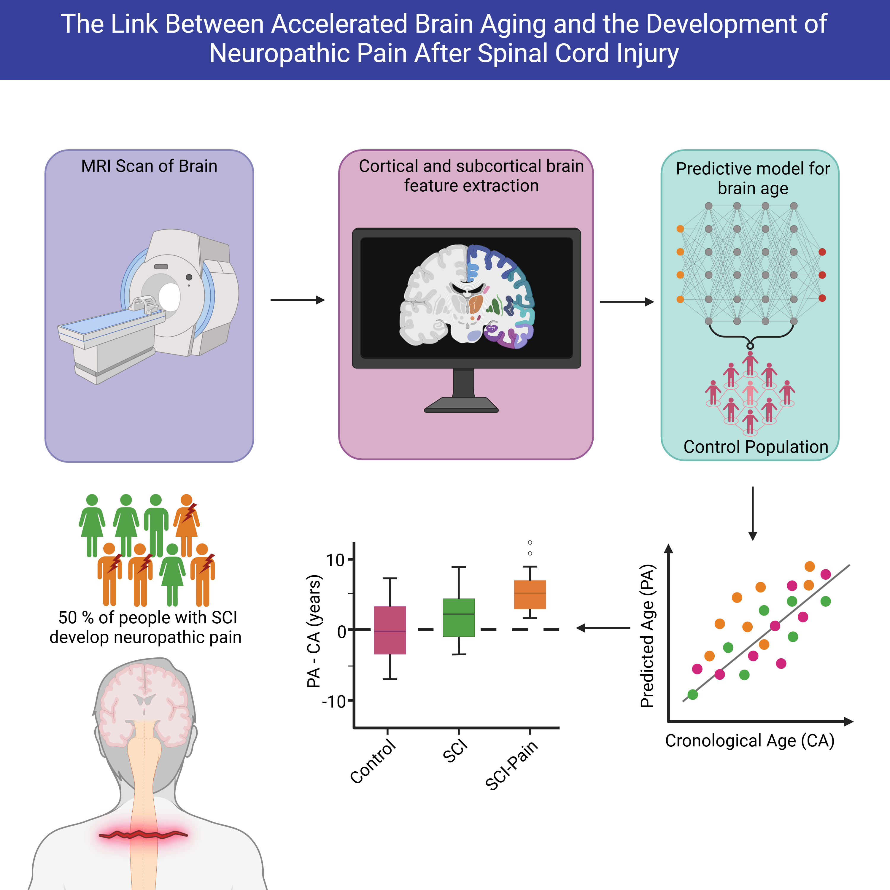
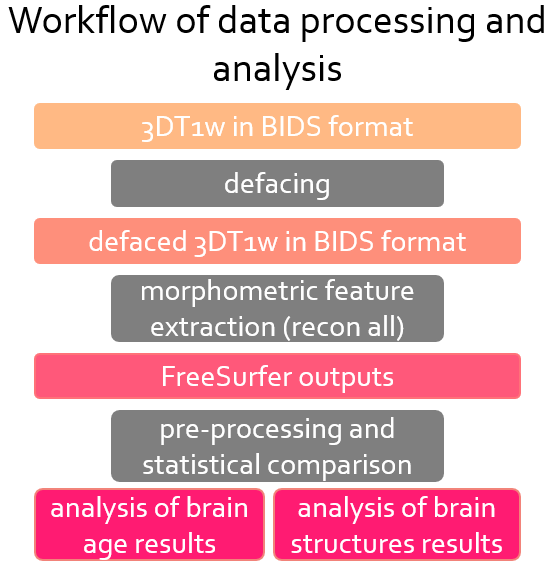
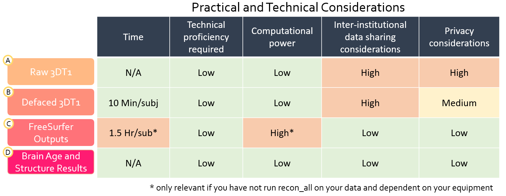
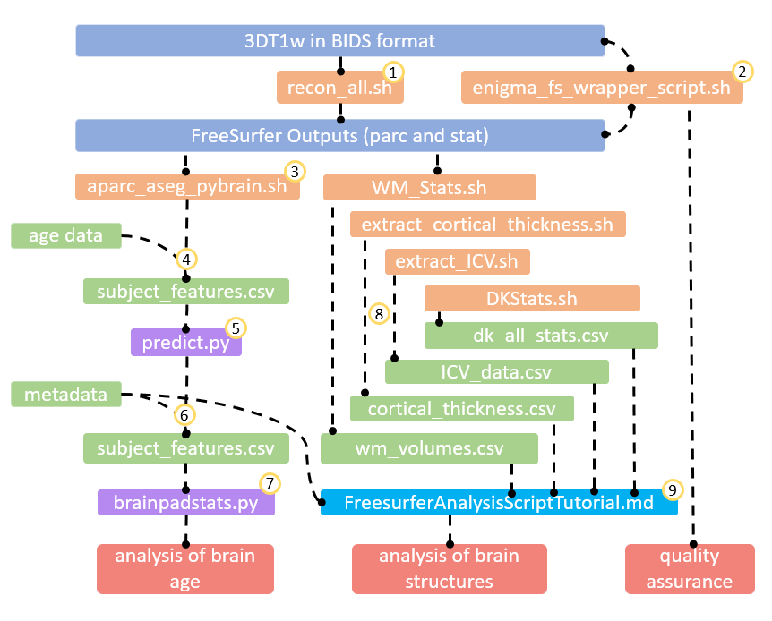
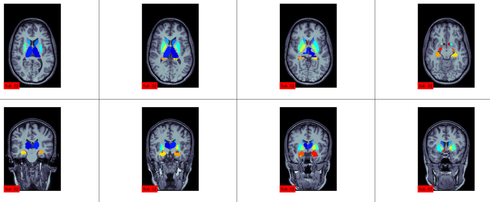
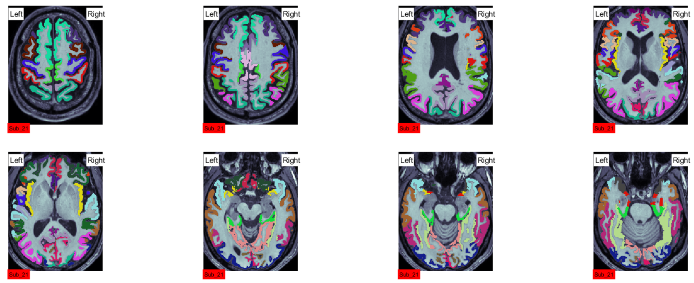
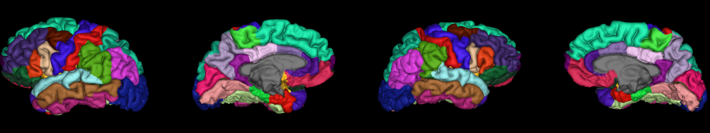

# SCI MAP
## Project Description

The SCI_MAP project is designed to analyze structural brain differences between individuals with spinal cord injury (SCI) and healthy age-matched controls. In SCI, alterations in brain structure and function can arise due to direct effects of nerve damage, secondary mechanisms, and long-term consequences such as paralysis and neuropathic pain. Structural brain maturation in humans is known to follow region-specific, non-linear trajectories characterized by progressive or regressive changes, such as gray matter atrophy.

One of the primary goals of this project is to quantify regional deviations in brain structure using BrainCharts normative modeling. Instead of estimating a single Brain Age Gap Estimation (BrainAGE) value, the current workflow applies pre-estimated lifespan normative models to FreeSurfer-derived regional cortical thickness and subcortical volume measures. The output is a set of regional z-scores that indicate how far each participant deviates from age-, sex-, and site-adjusted normative expectations.

In addition to the BrainCharts z-score analysis, a second primary aim of the project is to investigate raw regional FreeSurfer morphometry, including cortical thickness, cortical surface area, cortical volume, subcortical volume, intracranial volume, and white matter volume. Running both tracks allows us to test whether SCI and neuropathic pain effects are visible as normative deviations, raw morphometric group differences, or both.

This project also addresses the longstanding issue of limited sample sizes in SCI research, while taking into account privacy and ethical constraints surrounding the sharing of individual brain images across institutions. To that end, this repository provides each participating center with a standardized, baseline processing pipeline that enables local data analysis and avoids the need to transfer sensitive imaging data. This harmonized approach ensures that results remain comparable across sites and that meta-analyses can be reliably conducted. 

NOTE: The current pipeline has been tested in a Windows 10 system using Ubuntu WSL. 



Figure 1. Visual Summary of the project. 


After local processing, institutions are encouraged to share their FreeSurfer outputs (following Step 1 of the pipeline) along with non-identifiable subject metadata. These outputs can then be centrally aggregated by the coordinating team in Vancouver for further analysis and meta-analytic synthesis. As FreeSurfer outputs do not contain directly identifiable information, this method offers a secure and efficient mechanism for collaborative data pooling.


<div align="center">
  
</div>
Figure 2. Steps to the pipeline


However, recognizing that data sharing policies and logistical constraints vary across institutions, the pipeline has been designed to offer multiple integration points. Institutions can contribute at various stages based on their technical capabilities and ethical guidelines, ensuring broad participation without compromising compliance. Below there is a chart with the information to consider when deciding what step of the pipeline would be ideal your institution to share your data



Figure 3. Considerations when deciding on the step your institution would like to share your data. 

## Prerequisites

To participate in this project, you need:

1. **Neuroimaging Data**
   - 3D T1-weighted MRI scans from both SCI and (age and sex matched) control cohort scans
   - Data must be organized in BIDS format
   - Alternatively, you can also have the recon-all outputs from FreeSurfer

2. **Software Requirements**
   - WSL installation (Here tested on Ubuntu 22.04.5 LTS )
   - FreeSurfer (installed and operational, here tested on 7.4.1)
   - Python dependencies for BrainCharts/PCNtoolkit normative modeling
   - Matlab executable from WSL
   - RStudio

3. **Metadata Requirements**
   - Subject ID
   - Age
   - Cohort designation (SCI or Control)
   - Neuropathic pain status for SCI participants (if pain analysis is to be done)

## Data Structure

Your data should be organized following BIDS conventions. Ensure your naming schemes are consistent subject folders and image names (e.g. all subject folders are labeled as sub-xx where xx is the subject number, and all anatomical images follow a similar structure of sub-xx_T1w.nii.gz). Refer to datastructure below or refer to https://bids.neuroimaging.io/index.html

## Repository Purpose and Processing Pipeline

This repository serves as a centralized location for sharing processing scripts with all participating institutes in the SCI_MAP project. The standardized scripts ensure consistent analysis across different sites and datasets.



Figure 2. Summary of standarized steps for proecessing the data. Blue boxes represent FreeSurfer related outputs. Orange boxes represent bash scripts that need to be run in a WSL or linux environment. Purple boxes represent python scripts. Blue represents R scripts. Green represent .csv files. Finally, red represents the outputs that would be required to be sent for the meta analysis. 

### Step 0 (Optional): Defacing

**Defacing** refers to the removal of facial features from MRI scans to protect patient identity. Defacing raw 3D T1-weighted images ensures that medical imaging data can be shared ethically across institutions while respecting and preserving the anonymity of each participant. This step is only necessary if you plan to share raw 3D T1 images with the Vancouver team for pipeline processing. Therefore, we will not go into detail on how to perform defacing here. However, tools such as [**pydeface**](https://github.com/poldracklab/pydeface), [**mri_deface**](https://surfer.nmr.mgh.harvard.edu/fswiki/mri_deface), and [**fsl_deface**](https://fsl.fmrib.ox.ac.uk/fsl/fslwiki/fsl_deface) can be used to properly and ethically deface your images before sharing.


### Step 1: FreeSurfer Processing (recon_all.sh)

**Note:** If you have already run FreeSurfer's recon-all on your data, you can skip this step and proceed directly to Step 2. However, ensure you have a working FreeSurfer installation as it will be required for Step 3.

The initial processing step uses the `recon_all.sh` script located in the Step_1_Preprocessing folder. This script can be run on:
- Linux systems
- Windows systems using Windows Subsystem for Linux (WSL)
  - Recommended: Ubuntu on WSL
  - Make sure FreeSurfer is properly installed in your WSL environment

The script:

1. Takes BIDS-formatted T1w images as input
2. Applies FreeSurfer's `recon-all` command to perform:
   - Skull stripping
   - White matter segmentation
   - Surface reconstruction
   - Cortical parcellation
   - Subcortical segmentation
3. Generates structural information for subsequent analysis

**System Requirements:**
- For Windows users: WSL installed with Ubuntu distribution
- FreeSurfer properly configured in your Linux/WSL environment
- Sufficient disk space for FreeSurfer outputs (~1GB per subject)
- The thread and queue hardware allocation we have is based on our system containing an i7-13700k, RTX4070ti, 64GB DDR4 RAM. 

#### Usage
1. Open the `recon_all.sh` script and update the directory paths around line 49-53:
   ```bash
   # Update these paths in recon_all.sh
   RAWDATA_DIR="/path/to/rawdata"      # Directory containing your rawdata folder, containing subject folders with anatomical images
   DERIVATIVES_DIR="/path/to/derivatives"  # Directory where FreeSurfer outputs will be saved
   THREADS=6                           # Can change based on system hardware, if unsure, leave as is
   QUEUE_SIZE=2                        # Can change based on system hardware, if unsure, leave as is
   T1_PATTERN="*_T1w.nii.gz"           # Ending of the fileneame for T1w anatomical image within subject folder
   ```
   You may need to also update the main queue loop at the bottom around line 138:
   ```bash
   for subj_path in "$RAWDATA_DIR"/sub-*; do       # May need to change sub-* to fit the naming scheme of your subject folders. 
   ```
   sub-* assumes that your subject folders begin with 'sub-' and ends with an identifier. (e.g. sub-07, or sub-SCI42)

2. Make the script executable and run it:
   ```bash
   chmod +x processing/recon_all.sh
   ./processing/recon_all.sh
   ```

**Error Handling Tip:**
If you encounter script execution errors, especially when running on WSL or after editing on Windows, you may need to fix line endings using dos2unix:
```bash
# Install dos2unix if not already installed
sudo apt-get install dos2unix

# Convert the script to Unix format
dos2unix processing/recon_all.sh
```
This fixes the "bad interpreter" or similar errors caused by Windows-style line endings (CRLF).

The script will:
- Process all subjects found in your BIDS directory
- Create a FreeSurfer output directory for each subject
- Generate logs in the derivatives directory

**Example Directory Structure:**
```
study/
├── rawdata/                  # Your RAWDATA_DIR
│   ├── sub-001/
│   │   └── anat/
│   │       └── sub-001_T1w.nii.gz
│   └── sub-002/
│       └── anat/
│           └── sub-002_T1w.nii.gz
└── derivatives/              # Your DERIVATIVES_DIR
    └── freesurfer/
        ├── sub-001/
        └── sub-002/
```

#### Processing Time
- Approximately 1.5 hours per subject (benchmarked on NVIDIA RTX4070ti)

### Step 2: Quality Assurance

Quality control of the FreeSurfer outputs is performed using the ENIGMA QA pipeline. This step uses the `enigma_fs_wrapper_script.sh` (run from WSL or Linux command terminal) which has been modified from the original ENIGMA-FreeSurfer-protocol-main to work with both Windows and Linux paths. The script must be executed in a WSL or Linux terminal environment, even when working with Windows paths.

#### Prerequisites
1. **MATLAB Requirements:**
   - MATLAB R2023a or older installed
   - Image Processing Toolbox
   - Statistics and Machine Learning Toolbox

2. **Subject List File:**
   Create a text file (e.g., `subject_ids.txt`) containing one subject ID per line:
   ```text
   sub-001
   sub-002
   sub-003
   ```
   **Note:** Subject IDs must match the FreeSurfer output directory names

3. **FreeSurfer Outputs:**
   - Completed FreeSurfer processing for all subjects
   - Standard FreeSurfer directory structure
   - Required files:
     - `mri/orig_nu.mgz`
     - `mri/aparc+aseg.mgz`

**Important Updates:**
- Script has been modified to handle Windows/WSL and Linux paths automatically
- Path conversion has been tested with MATLAB R2023a
- MATLAB functions are compatible with both Windows and Linux environments
- Automatic path conversion between WSL and Windows formats for MATLAB calls

#### Usage Example
```bash
./enigma_fs_wrapper_script.sh \
  --subjects "/mnt/c/Users/kramerlab/Documents/freesurfer_SCI_extra_subjects/results_pybrain/subject_ids.txt" \
  --fsdir "/mnt/c/Users/kramerlab/Documents/freesurfer_SCI_extra_subjects/derivatives" \
  --outdir "/mnt/c/Users/kramerlab/Documents/freesurfer_SCI_extra_subjects/ENIGMA_outputs" \
  --script "/mnt/c/Users/kramerlab/Documents/SCI_Map/ENIGMA-FreeSurfer-protocol-main" \
  --matlab "/mnt/c/Program Files/MATLAB/R2023a/bin/matlab.exe" \
  --fs7 true \
  --step_1 true \
  --step_2 true \
  --step_3 true \
  --step_4 true \
  --step_5 true
```

#### Script Arguments
- `--subjects`: Text file containing list of subject IDs
- `--fsdir`: Directory containing FreeSurfer processed subjects
- `--outdir`: Directory where QA outputs will be saved
- `--script`: Path to the ENIGMA scripts directory (parent folder of ENIGMA_QC)
- `--matlab`: Path to MATLAB executable
- `--fs7`: Set to 'true' if using FreeSurfer 7+, 'false' otherwise
- `--step_1`: Extract subcortical measures (set to true) 
- `--step_2`: Extract cortical measures (set to true)
- `--step_3`: Generate subcortical QC images (set to true)
- `--step_4`: Generate internal cortical QC images (set to true)
- `--step_5`: Generate external cortical QC images (set to true)

#### QA Pipeline Steps
1. **Subcortical Measures (step_1)**
   - Extracts volumes of subcortical structures
   - Generates CSV file with measurements

2. **Cortical Measures (step_2)**
   - Extracts cortical thickness and surface area
   - Creates separate files for thickness and surface metrics

3. **Subcortical QC (step_3)**
   - Generates visualization of subcortical segmentations
   - Creates HTML report for visual inspection

4. **Internal Cortical QC (step_4)**
   - Generates internal view of cortical parcellation
   - Creates HTML report for reviewing internal boundaries

5. **External Cortical QC (step_5)**
   - Generates external surface views
   - Creates HTML report for surface quality review

#### Output Structure
```
ENIGMA_outputs/
├── measures/
│   ├── LandRvolumes.csv
│   ├── CorticalMeasuresENIGMA_ThickAvg.csv
│   └── CorticalMeasuresENIGMA_SurfAvg.csv
└── qc/
    ├── subcortical/
    │   └── ENIGMA_Subcortical_QC.html
    ├── cortical_internal/
    │   └── ENIGMA_Cortical_QC.html
    └── cortical_external/
        └── ENIGMA_External_QC.html
```

**Note:** For Windows/WSL users, make sure to:
1. Use Windows paths for MATLAB executable
2. Use WSL paths for other arguments
3. Ensure MATLAB can access the ENIGMA_QC functions

**Step 2: Quality Assessment Process:**
After generating the QC HTML files, visual inspection of the segmentations should be performed following the ENIGMA Cortical Quality Control Guide 2.0 [available here](https://enigma.ini.usc.edu/protocols/imaging-protocols/). 

Common QC Issues to Look For:

1. **Subcortical Segmentation Issues:**
   - Incorrect boundary definitions
   - Missing structures
   - Asymmetrical segmentation between hemispheres
   - Unusual shapes or volumes in subcortical structures

2. **Cortical Surface Problems:**
   - Skull strip failures (remaining dura/skull)
   - White matter segmentation errors
   - Pial surface overestimation
   - Missing gyri or sulci
   - Topological defects

3. **Motion Artifacts:**
   - Blurring or ringing in the original T1
   - Distorted segmentation due to movement
   - Inconsistent tissue boundaries

4. **Intensity Issues:**
   - Poor gray/white matter contrast
   - Intensity normalization failures
   - Bias field artifacts affecting segmentation

Follow the ENIGMA protocol guidelines to:
- Rate each scan's quality (Pass/Fail)
- Document specific issues found
- Make consistent decisions about subject exclusion
- Record QC decisions in a standardized format

Review each subject's QC HTML files thoroughly before proceeding to the next step. When in doubt, consult the detailed examples in the ENIGMA Cortical Quality Control Guide.

#### Example QC Outputs

**Subcortical QC HTML Example (step 3):**


**Internal Cortical QC HTML Example (step 4):**


**External Cortical QC HTML Example (step 5):**



These HTML files provide interactive views of the segmentation results for detailed quality assessment. Use them in conjunction with the ENIGMA QC guidelines to evaluate segmentation quality.
### Cortical Outlier Detection and Subcortical Histogram Plots

After visual QC, statistical quality control is performed using R scripts to generate histograms and identify potential outliers in the volumetric data.

#### Prerequisites

Before running the outlier detection and histogram analysis scripts, ensure you have:

1. **R and RStudio Installation**
   - A working installation of R (tested with version 4.4.0)
   - RStudio IDE (recommended for easier workflow)
   - The scripts in this repository were specifically tested with R version 4.4.0

2. **Required R Packages**
   - readr
   - dplyr
   These will be automatically installed if missing when running the scripts.

**Subcortical Histogram Analysis:**
The `subcortical_histogram_plots.R` script:

1. **Generates Histograms and Statistics**
   - Creates histograms for each subcortical structure (21 plots)
   - Generates an additional histogram for ICV (1 plot) 
   - Outputs summary statistics for each region in SummaryStats.txt
   - Calculates asymmetry measures between left/right structures

2. **Quality Control Features**
   - Handles missing values marked with 'x' or 'X'
   - Checks for negative volumes that may indicate segmentation errors
   - Reports number of subjects marked as poorly segmented for each structure
   - Helps identify statistical outliers needing additional review

3. **Output Files**
   - PNG histogram plots for each structure and ICV
   - SummaryStats.txt containing:
     - Number of subjects excluded
     - Sample size used
     - Mean volume
     - Standard deviation
   - Asymmetry measures between bilateral structures
   - ENIGMA_Plots.RData storing plot data

4. **Statistical Measures**
   - Calculates basic statistics (mean, SD) for each structure
   - Computes bilateral averages for paired structures
   - Generates asymmetry indices using (L-R)/(L+R) formula
   - Adapts histogram bins based on sample size

The `subcortical_histogram_plots.R` script requires editing the following paths:

Lines 25-26 to your ENIGMA_outputs/measures/LandRvolumes.csv file and the output directory:
```R
input_path <- "C:/Users/kramerlab/Documents/freesurfer_SCI_extra_subjects/ENIGMA_outputs/measures/LandRvolumes.csv"
output_dir <- "C:/Users/kramerlab/Documents/freesurfer_SCI_extra_subjects/ENIGMA_outputs/measures"
```

**Cortical Outlier Detection:**
The `cortical_outliers.R` script performs outlier detection on cortical thickness and surface area measurements.
- Outputs in the R console messages about the structures from subjects marked as outliers.
- Gives you an idea of which areas and which subjects are potentially problematic and could be flagged for exclusion

The `cortical_outliers.R` script requires editing the following paths:

Lines 5 and 37 to point to your ENIGMA_outputs/measures/CorticalMeasuresENIGMA_ThickAvg.csv and CorticalMeasuresENIGMA_SurfAvg.csv files:

```R
dat=read.csv("C:/Users/kramerlab/Documents/freesurfer_SCI_extra_subjects/ENIGMA_outputs/measures/CorticalMeasuresENIGMA_ThickAvg.csv",stringsAsFactors=FALSE)
dat=read.csv("C:/Users/kramerlab/Documents/freesurfer_SCI_extra_subjects/ENIGMA_outputs/measures/CorticalMeasuresENIGMA_SurfAvg.csv",stringsAsFactors=FALSE)
```


### Recording QC Results

The ENIGMA protocol provides a standardized Excel template (ENIGMA_Cortical_QC_Template.xlsx) for recording QC decisions. To use this template:

1. **Open the Template**
   - Make a copy of ENIGMA_Cortical_QC_Template.xlsx for your study
   - Save it with a descriptive name (e.g., "SCI_MAP_QC_Results.xlsx")

2. **Fill in Required Fields**
   - Subject ID: Enter the subject identifier exactly as used in FreeSurfer
   - Pass/Fail: Mark as:
     - PASS (1) - Acceptable quality
     - FAIL (0) - Unusable due to quality issues
   - Notes: Document specific issues observed, such as:
     - "Significant dura inclusion in left temporal lobe"
     - "Motion artifacts affecting subcortical segmentation"
     - "Poor gray/white matter contrast in occipital region"

3. **Additional Columns**
   - Rating Confidence (1-3):
     1. Low confidence
     2. Medium confidence
     3. High confidence
   - Specific Issue Flags:
     - Motion_Artifact (0/1)
     - Skull_Strip_Error (0/1)
     - WM_Segmentation_Error (0/1)
     - Pial_Overestimation (0/1)

4. **Best Practices**
   - Complete the QC spreadsheet while viewing the QC HTML files
   - Be consistent in your rating criteria across subjects
   - When in doubt, consult the ENIGMA QC guide examples
   - Regular backups of the QC spreadsheet are recommended

The completed QC spreadsheet will be essential for:
- Tracking which subjects to include/exclude in analyses
- Documenting quality issues for methods sections
- Sharing QC decisions with collaborators
- Future reference and reproducibility

The filled ENIGMA_Cortical_QC_Template.xlsx should be shared with the primary group to assess how much data is being retained and keep logs of quality of data.


### Step 3: BrainCharts Normative Modeling

Steps 3 to 7 from the older BrainAGE workflow have been replaced by a single BrainCharts normative-modeling step. This step converts FreeSurfer outputs into the BrainCharts input format, uses a subset of healthy controls to adapt the model to each site/scanner, applies the normative models to the held-out controls and SCI participants, and exports regional z-scores for downstream analysis.

The workflow follows the core prediction and adaptation logic in [`apply_normative_models_ct.ipynb`](https://github.com/ortizo-117/braincharts_normative_modeling_SCI/blob/main/scripts/apply_normative_models_ct.ipynb). The scripts for this step are in `Step_3_BrainCharts_Normative_Modeling`.

**Prerequisites:**
- Completed and QC-approved FreeSurfer outputs from Step 1 and Step 2.
- A participant metadata CSV with at least `subject`, `age`, `sex`, `site`, `sitenum`, and `cohort`.
- A working Python environment with BrainCharts dependencies, including `pcntoolkit==0.35`, `numpy`, and `pandas`.
- A local clone of the BrainCharts repository with the `lifespan_57K_82sites` model downloaded and unzipped.

Clone and prepare the BrainCharts repository:

```bash
git clone https://github.com/predictive-clinical-neuroscience/braincharts.git
cd braincharts/models
unzip lifespan_57K_82sites.zip
```

Your metadata should use the same subject IDs as the FreeSurfer output folders. For example, a longitudinal FreeSurfer folder named `sub-CON1003_ses-BASE.long.sub-CON1003` must match the `subject` value used in the metadata, unless you intentionally filter or rename subjects before this step.

#### 3.1 Extract FreeSurfer measures

Run the FreeSurfer table builder from WSL/Linux after sourcing FreeSurfer:

```bash
bash Step_3_BrainCharts_Normative_Modeling/build_freesurfer_sheet.sh \
  --derivs /path/to/freesurfer_outputs \
  --outdir /path/to/outputs \
  --parc aparc.a2009s
```

This creates `_dbg_joined_all.csv` and separate debug CSVs for aseg volume, cortical thickness, and cortical surface area. The BrainCharts cortical-thickness model uses the `aparc.a2009s`/Destrieux cortical thickness columns and selected aseg volumes.

#### 3.2 Create the BrainCharts input sheet

Map the FreeSurfer headers to the BrainCharts model headers and merge the participant metadata:

```bash
bash Step_3_BrainCharts_Normative_Modeling/make_brainchart_outputs.sh \
  --joined /path/to/outputs/_dbg_joined_all.csv \
  --dict Step_3_BrainCharts_Normative_Modeling/keys_lifespan57K_82sites.csv \
  --metadata /path/to/metadata.csv \
  --outdir /path/to/outputs
```

The main output is:

```text
/path/to/outputs/braincharts_all_subjects.csv
```

Required metadata columns:

| Column | Meaning |
|:--|:--|
| `subject` | FreeSurfer subject/session ID |
| `age` | Age in years at scan |
| `sex` | Numeric sex covariate expected by the BrainCharts model, typically 0/1 |
| `site` | Site or scanner label |
| `sitenum` | Numeric site/scanner code used by PCNtoolkit adaptation |
| `cohort` | Healthy control versus SCI grouping |

#### 3.3 Split controls for site adaptation

Use a reproducible 50/50 split of healthy controls within each site. The adaptation file contains only healthy controls; the test file contains all SCI participants plus the held-out controls.

```bash
python Step_3_BrainCharts_Normative_Modeling/split_braincharts_adaptation_test.py \
  --input /path/to/outputs/braincharts_all_subjects.csv \
  --adaptation-out /path/to/outputs/braincharts_adaptation_controls.csv \
  --test-out /path/to/outputs/braincharts_test.csv \
  --adapt-fraction 0.5 \
  --seed 117
```

By default, the split script treats `cohort` values such as `0`, `control`, `healthy`, `HC`, and `SCI_H` as healthy controls. If your site uses different labels, pass them explicitly:

```bash
python Step_3_BrainCharts_Normative_Modeling/split_braincharts_adaptation_test.py \
  --input /path/to/outputs/braincharts_all_subjects.csv \
  --adaptation-out /path/to/outputs/braincharts_adaptation_controls.csv \
  --test-out /path/to/outputs/braincharts_test.csv \
  --control-values "Control,SCI_H" \
  --adapt-fraction 0.5 \
  --seed 117
```

#### 3.4 Apply the BrainCharts normative models

Run the command-line BrainCharts wrapper:

```bash
python Step_3_BrainCharts_Normative_Modeling/run_braincharts_normative_models.py \
  --braincharts-root /path/to/braincharts \
  --adaptation-csv /path/to/outputs/braincharts_adaptation_controls.csv \
  --test-csv /path/to/outputs/braincharts_test.csv \
  --output-dir /path/to/outputs/braincharts_normative_outputs \
  --force-adaptation
```

Main outputs:

| File | Contents |
|:--|:--|
| `braincharts_zscores.csv` | Metadata plus regional BrainCharts z-score columns. Use this file in Step 9. |
| `braincharts_test_with_zscores.csv` | Full BrainCharts test sheet plus z-score columns. Useful for auditing. |
| `braincharts_zscore_summary.csv` | Per-region z-score summary and outlier counts. |

If you and your group/institution are allowed to share FreeSurfer-derived outputs, the most useful files to send to the coordinating team are the QC-approved FreeSurfer stats, the metadata file, `braincharts_all_subjects.csv`, the adaptation/test split report, and `braincharts_zscores.csv`. These files contain regional measurements and metadata, not raw anatomical images.

### Step 8: Structural Data Aggregation

Step 8 prepares the raw FreeSurfer outputs used in the parallel raw morphometry analyses. These raw tables complement, but do not replace, the BrainCharts z-score file created in Step 3.

The scripts in `Step_8_Data_Aggregation` compile:

| Script | Main output | Analysis track |
|:--|:--|:--|
| `DKstats.sh` | `dk_all_stats.csv` | Raw cortical thickness, cortical surface area, cortical gray matter volume, and aseg subcortical volume |
| `extract_cortical_thickness.sh` | `cortical_thickness.csv` | Mean left/right cortical thickness QC or summary analysis |
| `extract_ICV.sh` | `icv_data.csv` | Intracranial volume covariate or summary analysis |
| `WM_Stats.sh` | `wm_volumes.csv` | Raw regional white matter volume |

The BrainCharts z-score track uses this file from Step 3:

```text
/path/to/outputs/braincharts_normative_outputs/braincharts_zscores.csv
```

The raw FreeSurfer track uses the Step 8 CSVs above. In Step 9, run the statistical analysis separately for each track so the meta-analysis can compare normative deviations against raw morphometric group differences.

**Potential issues and how to fix them**

If scripts are not executable, run:

```bash
chmod +x Step_8_Data_Aggregation/*.sh
```

If a script was edited on Windows and WSL reports carriage-return errors, run:

```bash
sed -i 's/\r$//' Step_8_Data_Aggregation/*.sh
```

### Step 9: Statistical Analysis for Structural Data

After aggregation, conduct the R analysis twice:

1. BrainCharts normative analysis using `braincharts_zscores.csv` from Step 3.
2. Raw FreeSurfer morphometry analysis using the Step 8 outputs for cortical thickness, cortical surface area, cortical volume, subcortical volume, ICV, and white matter volume.

Both analyses should estimate group differences and effect sizes for SCI versus healthy controls and, when available, SCI with neuropathic pain versus SCI without neuropathic pain. Please refer to the README in `Step_9_R_Analysis` for the expected inputs and outputs.

## Support and Contact

If you encounter any issues with this pipeline or have questions about its implementation, please contact:

Oscar Ortiz (Project Lead) 
Email: oscar.ortizangulo@ubc.ca

Ryan Loke 
Email: lokeryan@student.ubc.ca


